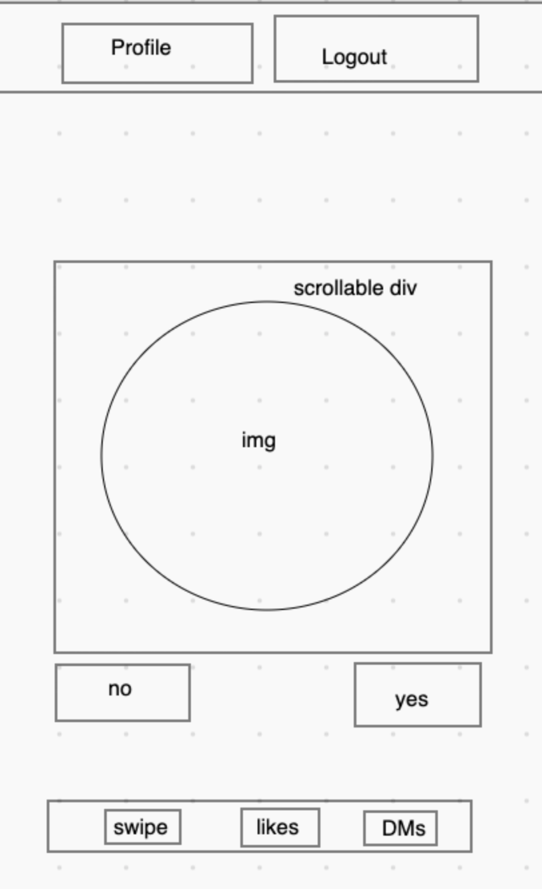
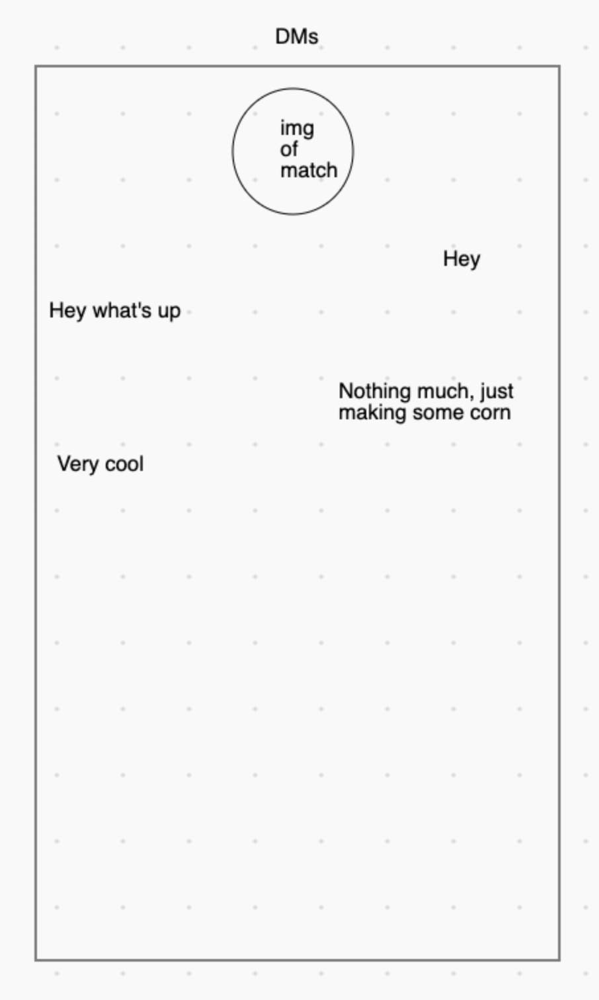

Token

[Live Version at](http://tokenapp-backend.herokuapp.com)

# Background
A dating application that implements messaging between users stored in the database. Once  logged in the user will be shown a randomly chosen profile that matches their prefence and location. The user can either "LIKE" the profile and initaite a conversation or request to view another randomly chosen profile. The application will tell you what users are currently online.

## User Stories
As a user, I want to be able to sign up with my age, gender, bio, location and search preferences to filter my results.
As a user I want to be able to look for matches and message the people that I find. I want to be able to accept messaging requests.
As a user, I want to be able to like someone's profile to notify them that I want to chat.
As a user, I want to be able to edit my profile pictures and information.

## Wireframes
### Main


### Direct messages


## Code
The application relies on sockets.io to enable messages between users. You can all user socket infornation in userChat.js and make tweeks accouding to your liking.
```js
  const roomId = props.room
  const user = props.me // Gets roomId from URL
  const id = props.room
  const type ="chat"
  const image =props.pic
  const time = Date.now()
  // console.log(props)
  const { messages, sendMessage } = useChat(roomId, user, id, type, image); // Creates a websocket and manages messaging
  const [newMessage, setNewMessage] = useState(``);
  /////////////////////
    const [text, setText] = useState("");
    const handleRoomNameChange = (event) => {
    setText(event.target.value);
  };
``` 
Each user is signed into their own channel that listens for incoming messages from the other users of the application. The channels are user's unique url that we create based on user's id assigned in the database - to make sure it is a unique value and no other messgaes will accidentally reach the channel. The redirect happens on log in.
```js
    let notification
    if (props.user) {notification = `/chat/${props.user.id}`}
    if (props.user) return <Redirect to={notification} />
```
<br />
Now that we have the channel ready we have to make sure our users stay within one page to constatly recieve updates in real time. We created a single page apllication that does not leave the url. We poulate our navigation bar with buttons that will togle "display: none" property of user's profile component and the component that enables "swiping" through user's database.  The buttons transfor themselves into routes if the user accidentaly closes the page and tries to access their profile from the landing page. Try it - it's resally cool!

Nav Bar buttons/routes
```js
  <div className="namaewa"> 
                            <button  className="namaewa navbutton" onClick={revealHome}>Home</button>
                            </div>
                            <div className="namaewa">
                                <button  className="namaewa navbutton" onClick={revealProfile}>Profile</button>
                            </div>
```

Redirect logic
```js
function revealProfile(){
        if(!document.querySelector('#profile')){
            let notification
                if (props.user) {notification = `/chat/${props.user.id}`}
                    window.location.href=notification 
        }
        document.querySelector('#profile').style.display="block";
        document.querySelector('#home').style.display="none";
    }
    function revealHome(){
        if(!document.querySelector('#profile')){
            let notification
                if (props.user) {notification = `/chat/${props.user.id}`}
                    window.location.href=notification 
        }
        document.querySelector('#home').style.display="block";
        document.querySelector('#profile').style.display="none";
    }
```

We automate requests to the database to display your dating options baseon on the user preference the back end routes essentially automate the routes in the same way.
```js
const getRandomUser = () => {
    let route;
    if (props.user.preference !== 'Both') {
      route = `${REACT_APP_SERVER_URL}/api/users/users/${props.user.gender}/${props.user.preference}/${props.user.email}/${props.user.location}`
    } else {
      route = `${REACT_APP_SERVER_URL}/api/users/users/random/${props.user.gender}/${props.user.email}/${props.user.location}`
    }
    Axios.get(route)
      .then(res => {
    setAccount(res.data.profile)
      }) .catch(err => {
    })
  }
```
We insert a channel listener into our Notifications.js. It is not displayed but acts more like a radio recieved to get our socket updates.
```js
       <div className="messages-list">
          {messages.map((message, i) => (
            <p
              key={i}
              className={`message-item ${
                message.ownedByCurrentUser ? "my-message" : "received-message"
              }`}
            > 
              <div >
                <div class="chatBox">
                
                  <p>{message.senderId}</p>
              <p> {message.body}</p>
        </div>
              <div class="chatBox they-say">
                <Response room={message.id} name={props.user.name} id ={props.user.id} email={account.email} type={message.type} pic={info.image_url} reload={setReload}/>
                </div>
              </div> 
              <div></div>
            </p>
          ))}
        </div>
```  
The Response.js handles responses to like requests and reveals a chat window if the user recieving the like wants to covers with the sender.
```js
       <div> 
           {
            props.type==="chat" ?
                <div className="blue" id={props.room}>
                     <Chat  room={props.id+props.room} me={props.name} id={props.id} type={"chat"} pic={props.pic} reload={props.reload} saveMessage={props.room} />
                     {/* <button onClick={handleChat}>Initiate Chat</button> */}
                </div>
               :
                <div>
                    <div className="chat" id={props.room}>
                        <Chat saveMessage={props.room} chat={handleChat} room={props.room+props.id} me={props.name} id={props.id} type={"chat"} pic={props.pic} reload={props.reload}/>
                    </div>
                    <button  id={props.room+props.id} onClick={handleSendMessage}>Chat</button>
                </div>
           }
       </div>
```
We create a unique channel for the 2 users ti chat by interpelationg their roomIds and attach that information to our messages
```js
</div>
<button  id={props.room+props.id} onClick={handleSendMessage}>Chat</button>
</div>
```
Have fun!